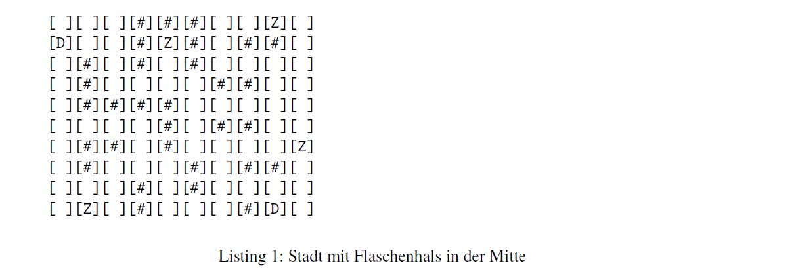
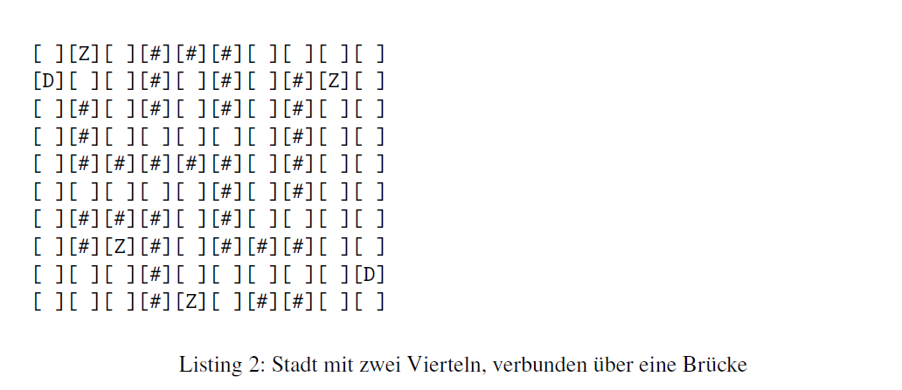

## 1. Karten- und Agentenmodell

a) Implementieren Sie eine diskrete 2D-Karte (mind. 10×10 Zellen) mit befahrbaren Zellen,
Hindernissen (Wänden), mindestens zwei Depots und mindestens drei Lieferzielen. Implementieren
Sie auf jeden Fall eine eigene Karte, selbst dann, wenn Sie die Beispiele unten
zum Testen nutzen. Argumentieren Sie: Was ist das Besondere an Ihrer Karte?  

b) Implementieren Sie ein Agentenmodell mit Position (𝑥, 𝑦), Geschwindigkeit in Zellen pro
Simulationsschritt, Kapazität (in Paketeinheiten) und Batteriestand. Erzeugen Sie mindestens
zwei Agententypen, Standard und Express.  

c) Implementieren Sie die Initialisierung und Hauptschleife der Simulation. Pro Schritt können
Agenten Nachrichten empfangen/lesen, Handlungen planen und eine Handlung ausführen
(Bewegung, Paket aufnehmen, Paket abliefern, Nachricht senden). Für die Bewegungslogik
können Sie zunächst zum Testen eine zufällige Richtungswahl implementieren;
die eigentliche Wegplanung ist Gegenstand von Aufgabe 3.  

Die Codierung der Karte und deren Gestalt können Sie frei wählen; hier sind zwei Beispiele,
die Sie als Grundlage für eigene Karten nutzen oder direkt übernehmen können:  

  
Karte 1 hat zwei Depots an den Positionen (0, 1) und (9, 8) sowie Ziele an den Positionen
(0, 8), (1, 4), (6, 9) und (9, 1). Hindernisse sind durch das Raute-Symbol # codiert. Die Klammern
[ und ] dienen der besseren Darstellung der einzelnen Felder und müssen nicht Teil der
Kartencodierung sein.
Auf der Karte sind keine Agenten dargestellt. Agenten entstehen am Anfang der Simulation
an zufälligen freien Stellen.
Ein weiteres Beispiel stellt eine Stadt mit zwei Vierteln dar:  
  

Diese Karte enthält zwei Depots (D) im linken Virtel bei (1, 0) und im rechten Viertel bei
(8, 9). Ziele (Z) befinden sich an den Positionen (0, 1), (1, 8), (7, 2) und (9, 4). Es existiert eine
„Brücke“ als Durchgang bei Spalte 4/5 rund um Zeilen 3 und 6, die die beiden Seiten verbindet.
Agenten können Sie zur Laufzeit mit Zahlen codieren/darstellen. Da die Agenten in dieser
Aufgabe noch keine echte Strategie besitzen, können Sie einfach zufällig in eine mögliche
Richtung laufen. Zwei Agenten können sich nicht gleichzeitig auf einem Feld befinden.  

**Erwartung**
Geben Sie zusammen mit dem Quelltext eine Darstellung der Karte
unmittelbar nach Erzeugung und Platzierung der Agenten sowie nach fünf Simulationsschritten  

## 2. Agenten-Kommunikation und Auftragsvergabe
Implementieren Sie nun ein einfaches Protokoll, mit dem die Depots Aufträge an Agenten
verteilen können. Es ist angelehnt an das ContractNet-Protokoll.  

a) Implementieren Sie die Logik des Nachrichtenversands und -empfangs zwischen Depot
und Agenten und unterhalb der Agenten. Nachrichtentypen sind: ANNOUNCE(task_id,
destination, deadline), BID(agent_id, task_id, cost) und AWARD(task_id, agent).  

b) Alle fünf Schritte entsteht ein neues Paket an einem zufällig gewählten Depot. (5 Punkte)  

c) Implementieren Sie die Bietlogik in den Agenten: Die Agenten haben eine interne Kostenfunktion,  
aufgrund derer sie die Kostenschätzung beim Gebot abgeben. Implementieren  
Sie zunächst die Kostenschätzung über die Manhattan-Distanz.  

d) Implementieren Sie die Zuschlagslogik: Der Manager wählt, wenn er nach der Simulationslogik
das nächste Mal an der Reihe ist, alle Angebote für den jeweiligen Versand aus--
und gibt einem der Agenten den Zuschlag.

**Erwartung**  
Loggen Sie für jede Ausschreibung Manager, Zahl der Bieter, Gewinner und gebotene Kosten.   
Führen Sie 5 Bieterrunden durch, und geben Sie das Ergebnis mit ab.

## 3. Wegsuche
Nun ist es an der Zeit, dass die Agenten sich auch tatsächlich bewegen können. Implementieren
Sie dafür nun die Wegsuche der Agenten:  

a) Erzeugen Sie aus der Karte einen Graphen. Dabei sind die Knoten (𝑥, 𝑦)-Positionen;  
Kanten legen Bewegungen mit Kosten in Abhängigkeit vom Agententyp fest. Sie können  
optional Zusatzkosten für Engpässe definieren.  

b) Implementieren Sie A* mit der Open-Liste als Prioritätswarteschlange und der Closed-  
Menge wie im Heft beschrieben. Implementieren Sie die heuristische Funktion ℎ(𝑛), die  
die Distanz zum Ziel nicht überschätzt.  

c) Jeder Agent nutzt nun A* zur Routenplanung. Bei einem neuen Auftrag wird der Weg  
vom aktuellen Standort zum Depot und dann weiter zum Ziel berechnet; bei Kollisionen  
oder Blockaden (z. B. durch andere Agenten auf der Route) wird eine neue Routenplanung  
durchgeführt.  

d) Was geschieht, wenn sich wenn sich Hindernisse auf der Karte bewegen? Können Sie eine bessere
Heuristik entwerfen?--

**Erwartung**  
Geben Sie mindestens einen A*-Lauf Schritt für Schritt im Log aus (Open/Closed, gewählter Knoten, finaler Pfad).

## 4. PROLOG-Wissensbasis für das Spiel
Sie setzen PROLOG zur Repräsentation von statischem Wissen und einfachen Ableitungen ein.  

a) Implementieren Sie eine PROLOG-Wissensbasis mit Fakten über befahrbare Felder, Hindernisse,  
Depots und Ziele (z. B. road(X,Y)., wall(X,Y). und depot(Id,X,Y).) und  
Regeln zur Nachbarschaftsermittlung (vertex((X1,Y1),(X2,Y2),Cost).) auf Basis der Karte.  

b) Implementieren Sie in PROLOG ein Prädikat reachable(From, To) (z. B. mit Tiefenoder  
Breitensuche), das prüft, ob ein Weg existiert, sowie ein Prädikat  
candidate_agent(Task, Agent), das unter allen bekanntenAgenten einen Kandidaten  
auswählt (z. B. minimale Distanz, ausreichend Kapazität und Batterieladung).  

c) Binden Sie PROLOG in Ihre Simulation ein (möglich z. B. über Datei-I/O oder Bibliothek1).  
Der Aufruf von reachable/2 erfolgt vor einer A*-Planung (Task nur vergeben,  
wenn erreichbar); candidate_agent/2 dient als Vorfilter, bevor das Contract-Net-Bieten startet.  

**Erwartung**  
Dokumentieren Sie mindestens zwei konkrete PROLOG-Abfragen inkl. Antworten, die in Ihrer Simulation tatsächlich genutzt werden.  
(1Für SWI-PROLOG existiert hierzu beispielsweise Janus: https://www.swi-prolog.org/pldoc/doc\_for
?object=section(\%27packages/janus.html\%27))  

## 5. Simulationsexperimente und Auswertung
simulatieren Sie Varianten mit 3, 5 und 10 Agenten unterschiedlicher Typen (Standard und  
Express). Nun müssen die Agenten und Ihre Software tatsächlich vollständig funktionieren, d. h.  
Pakete erzeugen, das Bieterverfahren durchführen; die Agenten müssen Pakete aufnehmen und  
abliefern. Messen Sie dafür die folgenden Kennzahlen:  

a) die Leistungskennzahlen des Systems: durchschnittliche Lieferzeit vom Erzeugen bis zur  
Zustellung eines Pakets, die Erfolgsquote (prozentualer Anteil der Aufträge, die innerhalb  
der vorgegebenen Maximalzeit erledigt werden) und die durchschnittliche Pfadlänge pro  
Auftrag und Agent (4 Punkte)  

b) die Eigenschaften der A*-Suche: die Anzahl der expandierten Knoten pro Planung sowie  
die mittlere und maximale Planungszeit (in ms echter Systemzeit)  
c) Loggen Sie die Kommunikationsmetriken: die durchschnittliche Anzahl von Nachrichten  
pro Auftrag und die durchschnittliche Anzahl von Bietern pro Auktion  

d) Welche Konflikte treten auf? Werten Sie aus, wie viele Kollisionen auftreten (z. B. zwei
Agentenwollen in denselben Knoten) und die Anzahl notwendigerNeuplanungen aufgrund
von Konflikten.  

e) Reflektieren Sie Ihren Einsatz von KI-Agenten, sofern Sie Sprachmodele oder Coding-  
Agenten eingesetzt haben. Welche Prompts haben Sie verwendet? Was hat Ihnen der  
Agent daraufhin generiert. Was haben Sie durch den Einsatz eines Agenten nicht gelernt?  
Wo haben Sie die Lösungen eines Agenten übernommen, wo angepasst, wo überprüft?  

**Erwartung**  
Erstellen Sie zu allen Metriken Plots, die – je nach Fragestellung – entweder  
kumulativ über die gesamte Simulation oder pro Zeitschritt aufgetragen werden. Zu jedem  
oben genannten Punkt muss mindestens ein Plot erzeugt werden. Beispiele: Die Leistungskennzahlen  
des Systems können als Performanz gegenüber der Agentenzahl geplottet werden;  
die Kosten der Suche als Histogramm oder Boxplot. Sie können die Simulationsläufe auch als  
Heatmap der Agentenwege mit Markierungen für Kollisionen darstellen.  

