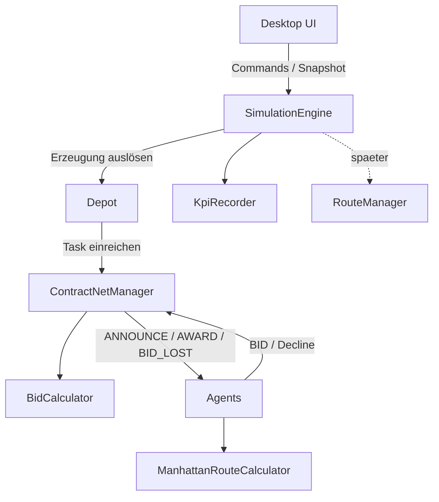

## Architektur

Die Architektur der Simulation folgt den Grundprinzipien **Keep it Simple (KISS)** und **Separation of Concerns**. Die einzelnen Komponenten besitzen klar abgegrenzte Verantwortlichkeiten und sollen nur das Wissen enthalten, das sie zur Erfüllung ihrer jeweiligen Aufgabe benötigen.

Dadurch soll die Komplexität des Gesamtsystems begrenzt und gleichzeitig ermöglicht werden, einzelne Komponenten gezielt zu verändern oder zu erweitern, ohne größere Änderungen an anderen Teilen des Systems vornehmen zu müssen.

### Trennung von Benutzeroberfläche und Simulationslogik

Eine grundlegende Architekturentscheidung ist die vollständige Trennung der eigentlichen Simulationslogik von der Benutzeroberfläche.

Die Simulation benötigt keine grafische Benutzeroberfläche für ihre Ausführung. Sämtliche für die Simulation notwendigen Komponenten, Zustände und Abläufe befinden sich im Simulationskern. Die Benutzeroberfläche dient ausschließlich der Darstellung des aktuellen Simulationszustands sowie der Interaktion mit der Simulation.

Dadurch kann die Simulation vollständig **headless**, also ohne grafische Benutzeroberfläche, ausgeführt werden.

Die grundlegende Struktur lässt sich vereinfacht wie folgt darstellen:



Die `SimulationEngine` löst die Task-Erzeugung im richtigen Simulationstick aus und injiziert den konkreten `ContractNetManager` beim Aufbau in die Depots. Das Depot reicht den erzeugten Task anschließend direkt beim `ContractNetManager` ein:

```text
SimulationEngine
  | Task-Erzeugung auslösen
  v
Depot
  | Task einreichen
  v
ContractNetManager
```

Das Depot kennt dabei bewusst den konkreten `ContractNetManager`. Diese direkte Kopplung ist eine einfache und bewusste Designentscheidung: Das Depot ist der Ursprung neuer Aufträge und gibt sie direkt in den Contract-Net-Prozess. Eine zusätzliche Port-, Interface- oder Adapter-Schicht wird für den aktuellen Projektumfang nicht eingeführt. Das Depot entscheidet nicht über die Vergabe; diese Aufgabe liegt beim `BidCalculator`. Die `SimulationEngine` koordiniert weiterhin den globalen Simulationsablauf.

Die Benutzeroberfläche stellt damit lediglich eine mögliche Präsentationsschicht des Simulationssystems dar.

Diese Trennung ermöglicht insbesondere die spätere Verwendung alternativer Benutzeroberflächen. Beispielsweise könnte die bestehende Oberfläche durch ein webbasiertes Frontend ersetzt oder um ein solches ergänzt werden, ohne die eigentliche Simulationslogik verändern zu müssen.

Konzeptionell sind daher unterschiedliche Betriebs- und Darstellungsformen möglich:

```text id="1fq18m"
                     +-- Desktop UI
                     |
Simulation Core -----+-- Web UI
                     |
                     +-- CLI
                     |
                     +-- Headless / Batch
```

Der Headless-Betrieb besitzt zusätzlich einen wichtigen Vorteil für die experimentelle Nutzung der Simulation. Simulationsreihen können automatisiert und ohne den zusätzlichen Aufwand einer grafischen Darstellung durchgeführt werden.

So können beispielsweise unterschiedliche Systemkonfigurationen mehrfach ausgeführt und die dabei erhobenen Kennzahlen anschließend miteinander verglichen werden.

Die Benutzeroberfläche ist somit **Konsument des Simulationszustands, aber keine Voraussetzung für die Funktionsfähigkeit der Simulation**.

### Grundlegende Komponenten des Simulationskerns

Der Simulationskern besteht im Wesentlichen aus folgenden Komponenten:

* **Agenten** repräsentieren die autonomen Teilnehmer des Systems.
* **Depots** erzeugen und verwalten Transportaufträge.
* Der **ContractNetManager** bildet die zentrale Kommunikations- und Vermittlungskomponente des Contract-Net-Verfahrens.
* Der **BidCalculator** verwaltet Ausschreibungen, Gebote, Deadlines und die eigentliche Vergabe der Aufträge.
* Der **Agent** berechnet seine eigene Reichweite und die Kosten eines Auftrags.
* Die **SimulationEngine** steuert die Ticks und den Gesamtablauf der Simulation.

Die Verantwortlichkeiten dieser Komponenten werden bewusst voneinander getrennt.

### Rolle der SimulationEngine

Die `SimulationEngine` ist die steuernde Anwendungskomponente der Simulation. Sie ist bewusst dafür verantwortlich, den zeitlichen Ablauf zu koordinieren. Dazu gehören insbesondere:

* Erhöhen des Simulationsticks,
* Erzeugen neuer Tasks,
* Auswahl von Depot und Ziel,
* Vergabe von Task-ID und Deadline,
* Ausführen der Agentenaktionen,
* Starten der Contract-Net-Auswertung,
* Fortschreiben der Simulations- und KPI-Daten.

Die `SimulationEngine` bestimmt den Zeitpunkt sowie die globalen Erzeugungsparameter wie Task-ID, Ziel und Deadline. Das Depot registriert den Task in seinem eigenen Kontext und reicht ihn direkt über den injizierten `ContractNetManager` in den Contract-Net-Prozess ein. Eine zusätzliche `TaskCreationService` oder Interface-Schicht ist für den aktuellen Umfang nicht notwendig.

Die Engine koordiniert den Ablauf, übernimmt aber nicht jede fachliche Einzelentscheidung. Beispielsweise berechnet der Agent seine eigene Reichweite und der `BidCalculator` entscheidet über das Gewinnergebot.

### Autonomie der Agenten

Die Agenten handeln innerhalb ihres jeweiligen Verantwortungsbereichs autonom. Autonomie bedeutet dabei nicht, dass jeder Agent sämtliche Entscheidungen des Gesamtsystems selbst treffen muss.

Wird ein neuer Auftrag ausgeschrieben, entscheidet ein Agent eigenständig, ob er an der Ausschreibung teilnimmt und ein Gebot abgibt. Grundlage hierfür sind sein eigener Zustand und seine aktuelle Auftragsplanung.

Globale Koordinationsaufgaben werden dagegen bewusst an spezialisierte Komponenten delegiert. Dadurch müssen die Agenten beispielsweise weder die Auftragsvergabe untereinander aushandeln noch globale Informationen über die geplanten Bewegungen anderer Agenten verwalten.

Die Reichweiten- und Kostenentscheidung bleibt jedoch beim Agenten. Er kennt seine aktuelle Position, Batterie und seinen Energieverbrauch und entscheidet deshalb selbst, ob ein Auftrag für ihn ausführbar ist. Nur wenn diese Prüfung erfolgreich ist, kann er ein `BID` abgeben.

Die Architektur kann daher als **Multiagentensystem mit zentralen Koordinationsdiensten** betrachtet werden.

### Kommunikation über den ContractNetManager

Der `ContractNetManager` bildet den zentralen Kommunikationsweg für die auftragsbezogene Kommunikation innerhalb des Multiagentensystems.

Agenten registrieren sich beim `ContractNetManager` und kommunizieren bezüglich Ausschreibungen, Geboten und Zustandsänderungen von Aufträgen ausschließlich über diese Komponente.

Der `ContractNetManager` übernimmt jedoch bewusst **nicht die fachliche Durchführung einer Auktion**.

Seine Aufgabe besteht darin, Nachrichten zwischen den beteiligten Komponenten zu vermitteln und den Kommunikationsweg zwischen Depots, Agenten und dem `BidCalculator` bereitzustellen.

Vereinfacht ergibt sich folgende Kommunikationsstruktur:

```text id="y50ek4"
                     Depot
                       |
                       v
              ContractNetManager
                 /           \
                /             \
               v               v
      BidCalculator         Agents
```

Der `BidCalculator` benötigt dadurch keinen eigenen Kommunikationsmechanismus zu den Agenten.

Diese Trennung verhindert, dass Kommunikationslogik und Vergabelogik miteinander vermischt werden.

### BidCalculator

Der `BidCalculator` ist vollständig für den fachlichen Lebenszyklus einer Ausschreibung verantwortlich.

Wird durch die `SimulationEngine` ein neuer Auftrag erzeugt, wird er beim Depot registriert. Das Depot übergibt ihn anschließend direkt an den injizierten `ContractNetManager`. Dieser übergibt den Auftrag an den `BidCalculator`, der daraus eine neue Ausschreibung erzeugt.

Zu seinen Aufgaben gehören insbesondere:

* Erzeugen und Verwalten einer Ausschreibung,
* Verwalten und Prüfen der zugehörigen Deadline,
* Sammeln und Zuordnen eingehender Gebote,
* Beenden der Ausschreibung nach Ablauf der Deadline,
* Bewerten der eingegangenen Gebote,
* Ermitteln des erfolgreichen Gebots,
* Bereitstellen des Ergebnisses der Ausschreibung.

Der `BidCalculator` ist damit für die Frage verantwortlich:

> **Welches Gebot gewinnt die Ausschreibung?**

Er ist dagegen nicht dafür verantwortlich, die hierfür notwendigen Nachrichten selbst an Agenten zu übertragen.

### Auftragsvergabe mittels Contract Net

Die Auftragsvergabe orientiert sich am Contract Net Protocol.

Die `SimulationEngine` erzeugt zunächst einen neuen Transportauftrag und registriert diesen beim ausgewählten Depot.

Das Depot übergibt den Auftrag anschließend direkt an den `ContractNetManager`. Dieser übergibt den Auftrag an den `BidCalculator`, der die zugehörige Ausschreibung erzeugt und verwaltet.

Die Veröffentlichung gegenüber den registrierten Agenten erfolgt anschließend über den `ContractNetManager` mittels einer `ANNOUNCE`-Nachricht.

```text id="mds9bw"
SimulationEngine
  |
  | neuer Auftrag
  v
ContractNetManager
  |
  | Auftrag
  v
BidCalculator
  |
  | Ausschreibung erzeugen
  |
  v
ContractNetManager
  |
  | ANNOUNCE
  +--------------------------+
  |                          |
  v                          v
Agent A                    Agent B
```

Jeder Agent entscheidet anschließend selbstständig, ob er an der Ausschreibung teilnehmen möchte.

Entscheidet er sich für eine Teilnahme, berechnet er die Kosten für die Übernahme des Auftrags und sendet ein `BID` an den `ContractNetManager`.

Dieser leitet das Gebot an den `BidCalculator` weiter:

```text id="grg3fn"
Agent
  |
  | BID
  v
ContractNetManager
  |
  | BID
  v
BidCalculator
```

Der `BidCalculator` sammelt die eingegangenen Gebote bis zum Erreichen der Deadline.

Nach Ablauf der Deadline wird die Ausschreibung geschlossen und die eingegangenen Gebote werden bewertet. Der `BidCalculator` bestimmt anschließend das erfolgreiche Gebot und stellt das Ergebnis dem `ContractNetManager` zur Verfügung.

Dieser übernimmt wiederum die Kommunikation mit den Agenten:

```text id="k6xtef"
                    BidCalculator
                          |
                          | Ergebnis
                          v
                  ContractNetManager
                    /           \
                   /             \
                 WIN          BID_LOST
                  |               |
                  v               v
              Gewinner        übrige Bieter
```

Damit besteht eine klare Trennung zwischen **Vergabeentscheidung und Kommunikation**:

```text id="pjmvw7"
BidCalculator
    |
    +-- Was wird ausgeschrieben?
    +-- Welche Gebote liegen vor?
    +-- Wann endet die Auktion?
    +-- Welches Gebot gewinnt?


ContractNetManager
    |
    +-- Wer erhält ANNOUNCE?
    +-- Weiterleitung der BIDs
    +-- Übermittlung von WIN
    +-- Übermittlung von BID_LOST
    +-- Vermittlung weiterer Task-Nachrichten
```

### Lebenszyklus eines Auftrags

Nach erfolgreicher Vergabe erhält der Auftrag im Depot den Status `await_pickup`.

Der erfolgreiche Agent fährt anschließend zum entsprechenden Depot. Der Ladevorgang benötigt einen Simulationstick. Nach dem Pickup wechselt der Auftrag im Depot in den Zustand `in_transport`.

Nach Erreichen des Zielortes meldet der Agent die erfolgreiche Auslieferung. Der Auftrag wird aus der Auftragsliste des Agenten entfernt und erhält im Depot den Status `delivered`.

Der vereinfachte Lebenszyklus lautet:

```text id="sk8dbf"
Auftrag erzeugt
      |
      v
Ausschreibung
      |
      v
Vergabe
      |
      v
await_pickup
      |
      | Agent erreicht Depot
      | + 1 Tick Ladezeit
      v
in_transport
      |
      | Agent erreicht Ziel
      v
delivered
```

Auch nach Abschluss der Auktion laufen auftragsbezogene Nachrichten weiterhin über den `ContractNetManager`.

Der `BidCalculator` ist an der eigentlichen Ausführung eines bereits vergebenen Auftrags nicht mehr beteiligt.

Dadurch endet seine Verantwortung mit der abgeschlossenen Vergabe.

### Verzicht auf direkte Inter-Agenten-Kommunikation

Eine direkte Kommunikation zwischen den Agenten wurde bewusst nicht vorgesehen.

Die für die Simulation notwendige Koordination erfolgt bereits über den `ContractNetManager`, den `BidCalculator` und die `SimulationEngine`.

Eine zusätzliche direkte Kommunikation zwischen Agenten würde weitere Koordinationsmechanismen erforderlich machen, ohne für das betrachtete Szenario einen notwendigen funktionalen Mehrwert zu liefern.

Insbesondere müssten bei konkurrierenden Interessen zusätzliche Regeln definiert werden. Möchten beispielsweise zwei Agenten zum gleichen Zeitpunkt dieselbe Position belegen, müsste bei direkter Kommunikation festgelegt werden, welcher Agent Priorität besitzt.

Daraus würden zusätzliche Fragestellungen hinsichtlich Priorisierung, gleichzeitig eintreffender Nachrichten, Deadlocks und möglicher Wartezustände entstehen.

Auf diese zusätzliche Komplexität wird bewusst verzichtet.

Sollte eine spätere Erweiterung eine tatsächliche Kooperation oder Verhandlung zwischen Agenten erfordern, kann eine entsprechende Kommunikationsform gezielt ergänzt werden.

### Wegplanung und Bewegung

Der Agent besitzt seine eigene Position und führt seine Bewegung aus. Er entscheidet jedoch nicht über globale Kollisionsfreiheit. Diese Verantwortung liegt beim geplanten `RouteManager`, der die Routen aller Agents gemeinsam berechnet und zeitliche Überschneidungen prüft.

Der `ManhattanRouteCalculator` wird vom Agenten für die eigene Distanz- und Reichweitenberechnung verwendet. Damit bleibt die Frage

> „Kann ich diesen Auftrag mit meiner aktuellen Batterie übernehmen?“

beim Agenten.

Die `SimulationEngine` steuert aktuell den Tick und ruft die Agentenaktionen auf. In der nächsten Ausbaustufe übergibt sie die Bewegungsabsichten an den `RouteManager`. Dieser berechnet für jeden Agenten eine Route, prüft Kollisionen und liefert die zulässigen Bewegungsschritte zurück.

Damit bleibt die Verantwortung klar getrennt:

```text
Agent:
  eigene Position und Bewegungsentscheidung

RouteManager:
  globale Routenplanung und Kollisionsprüfung

SimulationEngine:
  Tick-Steuerung und Anwendung der geplanten Bewegung
```

### Trennung der Verantwortlichkeiten

Aus den beschriebenen Entscheidungen ergibt sich folgende grundlegende Aufteilung:

```text id="l4epjh"
Simulation Core
|
+-- SimulationEngine
|    |
|    +-- Steuerung der Simulationsticks
|    +-- Erzeugung von Tasks
|    +-- Ausführung der Agentenaktionen
|    +-- Start der Contract-Net-Auswertung
|    +-- KPI-Aufzeichnung
|
+-- Depot
|    |
|    +-- Verwaltung der zugeordneten Tasks
|
+-- ContractNetManager
|    |
|    +-- Registrierung der Agenten
|    +-- zentrale Nachrichtenvermittlung
|    +-- ANNOUNCE
|    +-- Weiterleitung von BID
|    +-- Übermittlung von AWARD / BID_LOST
|    +-- Vermittlung weiterer Task-Nachrichten
|
+-- BidCalculator
|    |
|    +-- Verwaltung der Ausschreibungen
|    +-- Verwaltung der Deadlines
|    +-- Sammlung der Gebote
|    +-- Bewertung der Gebote
|    +-- Ermittlung des Gewinners
|    +-- Erzeugung von AWARD / BID_LOST / NO_BID
|
+-- Agent
|    |
|    +-- eigener Zustand
|    +-- eigene Auftragsliste
|    +-- Entscheidung über Teilnahme an Ausschreibungen
|    +-- Berechnung der eigenen Reichweite und des Gebots
|    +-- Ausführung angenommener Aufträge
|
 +-- ManhattanRouteCalculator
|    |
|    +-- Berechnung geometrischer Distanzen
|
+-- RouteManager (geplant)
  |
  +-- Routen für alle Agents
  +-- zeitliche Kollisionsprüfung
|
+-- SimulationEngine
     |
     +-- Verwaltung der Simulationsticks
     +-- zeitliche Synchronisation der Simulation
```

Die Verantwortlichkeiten lassen sich damit auf wenige zentrale Fragestellungen reduzieren:

```text id="50u7w2"
Depot
    "Welche Aufträge existieren und welchen Status haben sie?"

Agent
    "Biete ich auf einen Auftrag und wie führe ich ihn aus?"

ContractNetManager
    "Wie werden die beteiligten Komponenten miteinander verbunden?"

BidCalculator
    "Welches Gebot gewinnt die Ausschreibung?"

 +-- ManhattanRouteCalculator
  "Wie groß ist die geometrische Distanz zwischen zwei Positionen?"

SimulationEngine
  "Welcher Simulationszeitpunkt liegt aktuell vor und welcher Ablauf wird ausgeführt?"
|    |
|    +-- Routen für alle Agents
|    +-- zeitliche Kollisionsprüfung
* **Keep it Simple:** Es werden nur Kommunikations- und Koordinationsmechanismen implementiert, die für das betrachtete Szenario tatsächlich benötigt werden.
* **Separation of Concerns:** Jede Komponente besitzt einen klar abgegrenzten Verantwortungsbereich.
* **Lose Kopplung:** Komponenten besitzen möglichst wenig Wissen über die interne Funktionsweise anderer Komponenten.
* **Gezielte Erweiterbarkeit:** Neue Anforderungen sollen möglichst durch Änderungen oder Ergänzungen einzelner Komponenten umgesetzt werden können.
* **Austauschbarkeit:** Insbesondere Wegplanung, Vergabestrategie und Benutzeroberfläche können unabhängig voneinander verändert oder ersetzt werden.
* **Testbarkeit:** Komponenten wie `BidCalculator`, `AwardPolicy` und `ManhattanRouteCalculator` können unabhängig vom vollständigen Multiagentensystem getestet werden.
* **UI-Unabhängigkeit:** Die Simulationslogik ist unabhängig von ihrer Darstellung und kann sowohl mit unterschiedlichen Benutzeroberflächen als auch vollständig headless betrieben werden.

Die Aufteilung zwischen `ContractNetManager` und `BidCalculator` folgt diesen Prinzipien besonders deutlich. Der `ContractNetManager` stellt die Kommunikationsstruktur des Contract-Net-Verfahrens bereit, während der `BidCalculator` ausschließlich die fachliche Durchführung und Entscheidung der Ausschreibungen übernimmt.

Dadurch können beispielsweise die Vergabestrategie oder die Regeln einer Ausschreibung verändert werden, ohne die Kommunikationsmechanismen zwischen den Agenten anpassen zu müssen. Umgekehrt können Änderungen an der Nachrichtenvermittlung vorgenommen werden, ohne die eigentliche Vergabelogik zu verändern.

Ziel ist nicht, ein möglichst komplexes oder vollständig dezentrales Multiagentensystem zu entwickeln. Stattdessen soll eine nachvollziehbare und für die Aufgabenstellung angemessene Architektur entstehen, bei der autonome Agenten mit klar abgegrenzten zentralen Koordinationsdiensten zusammenarbeiten und unnötige Abhängigkeiten zwischen den einzelnen Komponenten vermieden werden.
