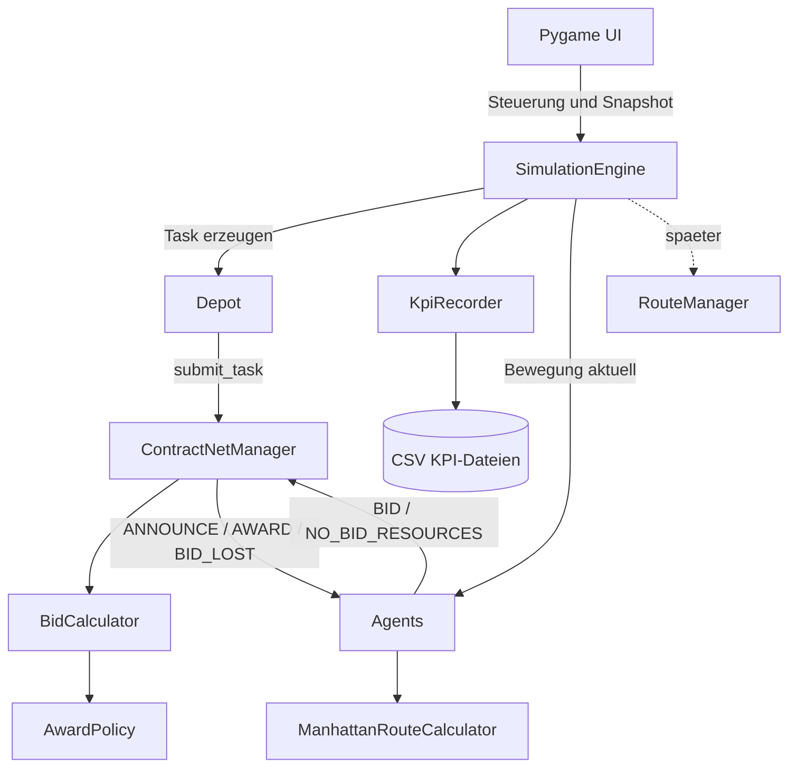
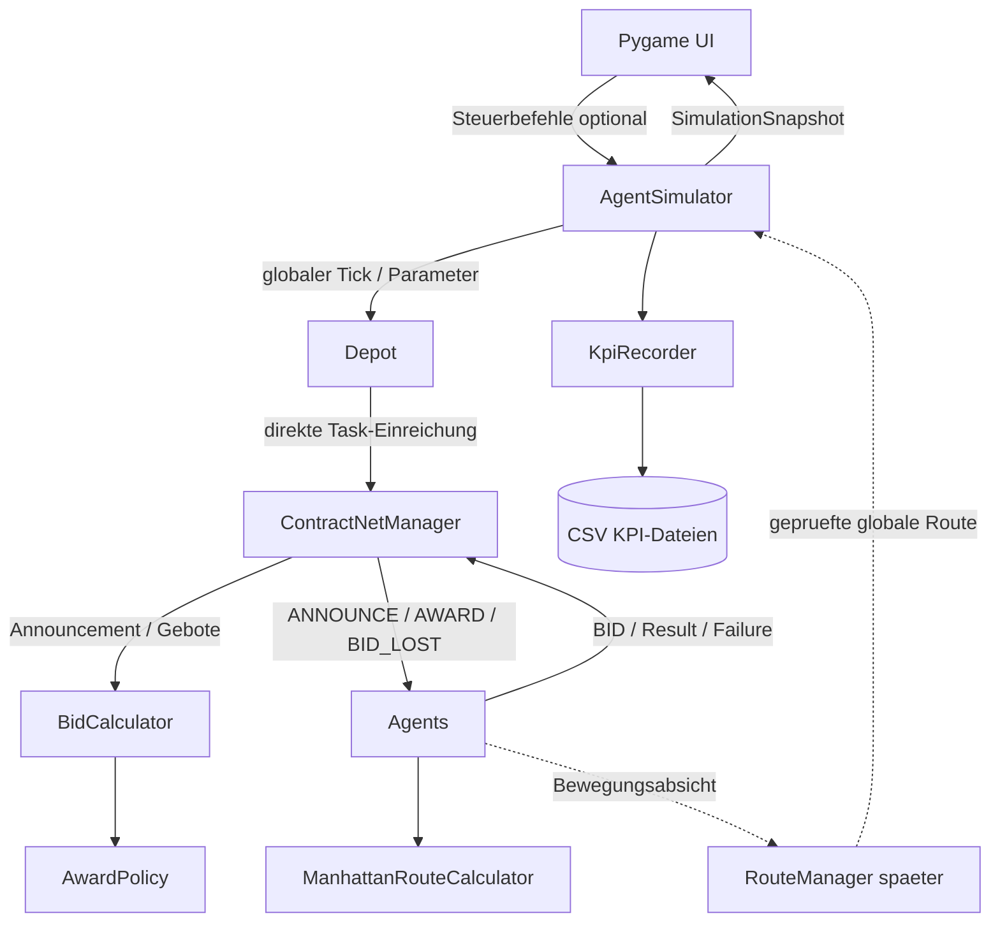

# Architektur und Migrationsstrategie

## 1. Ziel

Die Simulation soll fachliche Verantwortung möglichst dort halten, wo die notwendigen Informationen vorhanden sind. Die `SimulationEngine` beziehungsweise der spätere `AgentSimulator` steuert den globalen Ablauf. Agents, Depots, Contract-Net und KPI-Aufzeichnung bleiben für ihre jeweiligen Aufgaben verantwortlich.

Die Architektur folgt bewusst KISS und Separation of Concerns. Es werden keine zusätzlichen Ports, Interfaces, Adapter oder Services eingeführt, solange sie für den aktuellen Projektumfang keinen konkreten Nutzen liefern.

## 2. Aktueller Ist-Zustand



### Verantwortlichkeiten

| Komponente | Verantwortung |
|---|---|
| `SimulationEngine` | Tick-Steuerung, Task-Erzeugung, globale Ablaufkoordination und Snapshot-Erzeugung |
| `Depot` | eigene Tasks verwalten und neue Tasks direkt beim `ContractNetManager` einreichen |
| `Agent` | eigener Zustand, eigene Position, Batterie, Reichweite, Kosten und Contract-Net-Reaktionen |
| `ContractNetManager` | Contract-Net-Kommunikation, Registrierung, Event-Historie und Nachrichtenverteilung |
| `BidCalculator` | Ausschreibungen, Gebote, Deadlines und Vergabeergebnisse |
| `AwardPolicy` | Auswahl des Gewinnergebots |
| `KpiRecorder` | zentrale KPI-Erfassung und CSV-Speicherung |
| `ManhattanRouteCalculator` | geometrische Distanzberechnung für den Agenten |
| `RouteManager` | geplante spätere globale Routen- und Kollisionsplanung |

## 3. Bewusste Architekturentscheidungen

### SimulationEngine als Orchestrator

Die Engine kennt den globalen Tick, die Task-ID, das ausgewählte Depot, das Ziel und die Deadline. Deshalb ist es sinnvoll, dass sie die Task-Erzeugung auslöst und den Ablauf eines Ticks steuert.

Sie entscheidet jedoch nicht über die fachliche Reichweite eines Agents oder über den Gewinner einer Ausschreibung.

```text
SimulationEngine:
    Wann läuft welcher Ablauf?

Agent:
    Kann ich diesen Auftrag ausführen?

BidCalculator:
    Welches Gebot gewinnt?
```

Eine zusätzliche `TaskCreationService` ist für den aktuellen Umfang nicht vorgesehen.

### Direkte Depot-Kommunikation

Das Depot besitzt bewusst eine konkrete Referenz auf den `ContractNetManager`. Die Referenz wird beim Aufbau der Simulation von der Engine injiziert.

```text
SimulationEngine
    | verbindet Depots mit dem Manager
    v
Depot
    | submit_task(...)
    v
ContractNetManager
```

Diese direkte Kopplung ist eine bewusste KISS-Entscheidung. Das Depot ist der Ursprung eines Auftrags und gibt ihn direkt in den Contract-Net-Prozess. Eine zusätzliche Port-, Protocol-, ABC- oder Adapter-Schicht wird nicht eingeführt.

### Agenteneigene Reichweite

Der Agent berechnet seine eigene Reichweite und seine Lieferkosten. Er kennt seine Position, Batterie und seinen Energieverbrauch. Der `ManhattanRouteCalculator` unterstützt ihn dabei nur mit der Distanzberechnung.

Der Agent entscheidet selbst, ob er ein Gebot abgeben kann. Der `ContractNetManager` berechnet keine Agentenreichweite.

### KpiRecorder

Die KPI-Speicherung ist zentral im `KpiRecorder` gebündelt. Die Engine meldet Task-, Contract-Net- und Tick-Ereignisse an den Recorder. Die CSV-Dateien werden ausschließlich dort geschrieben.

### Snapshot und UI

Der Agent kommuniziert nicht direkt mit der UI. Seine Position ist Teil seines eigenen Zustands und wird über den Snapshot sichtbar:

```text
Agent.position
    -> SimulationEngine.snapshot()
    -> SimulationSnapshot.agents
    -> UI.draw_map() / UI.draw_right()
```

Der Snapshot beschreibt den Zustand; er ist kein Steuerungsobjekt. Die UI liest ihn und stellt ihn dar.

## 4. Was ist noch nicht ideal?

### 4.1 Bewegungsentscheidung liegt noch in der Engine

Der Agent besitzt seine Position und aktualisiert sie über `move_to()`. Die Engine berechnet aktuell jedoch noch mögliche Nachbarfelder, berücksichtigt belegte und reservierte Positionen und wählt das nächste Feld aus.

Das ist eine Übergangslösung. Der geplante `RouteManager` soll später globale Routen für alle Agents berechnen und Kollisionen prüfen.

### 4.2 Bid-Abgabe läuft teilweise über die Engine

Der Agent berechnet seine Kosten, die aktuelle Bid-Abgabe läuft aber noch über `SimulationEngine.submit_bid()` zum `ContractNetManager`.

Ziel:

```text
Agent berechnet BID
    -> ContractNetManager
    -> BidCalculator
```

### 4.3 Contract-Net-Protokoll kann später erweitert werden

Aktuell werden unter anderem unterstützt:

```text
ANNOUNCE
BID
NO_BID_RESOURCES
AWARD
BID_LOST
NO_BID
```

Für einen vollständigen Auftragslebenszyklus könnten später `INFORM_RESULT` und `FAILURE` ergänzt werden.

### 4.4 Erreichbarkeit ist vereinfacht

Die Energieprüfung ist vorhanden. Eine echte Prüfung, ob ein Ziel im begehbaren Graphpfad liegt, ist noch nicht vollständig umgesetzt. Diese Prüfung gehört fachlich weiterhin in den Agenten beziehungsweise in die von ihm verwendete Routenberechnung.

## 5. Migrationsstrategie

Die Migration erfolgt schrittweise. Nach jedem Schritt bleibt die Simulation kompilierbar und ausführbar. Alte und neue Zuständigkeiten dürfen nicht dauerhaft parallel aktiv sein.

### Schritt 0: Ausgangszustand sichern

- Contract-Net-Ablauf testen: `ANNOUNCE -> BID -> Deadline -> AWARD`.
- mindestens 100 Simulationsticks headless ausführen.
- UI starten und Snapshot-Darstellung prüfen.
- KPI-Dateien prüfen.

### Schritt 1: Agentenbewegung stabilisieren

Bereits teilweise umgesetzt:

- `Agent` besitzt `position`.
- `Agent.move_to()` verändert die eigene Position.
- `Agent.move_to()` reduziert die Batterie.
- `STRANDED`-Agents können sich nicht bewegen.
- Der Snapshot verwendet die Position des Agents.

Die Engine darf zunächst noch die zulässige Bewegung vorbereiten.

### Schritt 2: Depot und Contract-Net stabilisieren

Bereits umgesetzt:

```text
Depot
    -> ContractNetManager.submit_task()
    -> BidCalculator
    -> ANNOUNCE an Agents
```

Die direkte konkrete Kopplung bleibt bewusst bestehen. Es wird kein Port eingeführt.

### Schritt 3: Bid-Abgabe stärker beim Agenten verankern

Aktuell:

```text
Agent berechnet Kosten
    -> SimulationEngine.submit_bid()
    -> ContractNetManager.record_bid()
```

Ziel:

```text
Agent berechnet und sendet BID
    -> ContractNetManager
    -> BidCalculator
```

Die Engine ruft dann nur noch den Agenten beziehungsweise dessen Aktion auf.

### Schritt 4: RouteManager einführen

Der `RouteManager` wird erst eingeführt, wenn die Agentenbewegung stabil ist.

Aufgaben:

- globale Route für jeden Agenten berechnen,
- Position und Zeit berücksichtigen,
- Kollisionen erkennen,
- zulässige Bewegungsschritte zurückgeben.

Zielablauf:

```text
Agent meldet Bewegungsabsicht
    -> RouteManager berechnet globale Routen
    -> RouteManager prüft Kollisionen
    -> SimulationEngine wendet erlaubten Schritt an
    -> Agent aktualisiert seine Position
```

### Schritt 5: Contract-Net vervollständigen

Später können ergänzt werden:

- `INFORM_RESULT` bei erfolgreicher Zustellung,
- `FAILURE` bei nicht möglicher Ausführung,
- explizite Zustände je Ausschreibung.

### Schritt 6: Öffentliches Simulationsobjekt einführen

Die aktuelle `SimulationEngine` erfüllt bereits die fachliche Rolle des zentralen Simulationsobjekts. Im Rahmen der geplanten Migration wird sie zu `AgentSimulator` umbenannt beziehungsweise unter diesem Namen öffentlich bereitgestellt.

Die UI erhält danach nur noch dieses eine Objekt:

```text
AgentSimulator
    +-- start / pause / step / reset
    +-- snapshot
```

Die internen Agents, Depots, Contract-Net-Dienste und KPI-Komponenten werden nicht an die UI weitergereicht.

### Schritt 7: Dokumentation und Tests synchron halten

Nach jedem Schritt werden aktualisiert:

- Architekturdiagramm,
- Sequenzdiagramm,
- Verantwortlichkeitstabelle,
- fokussierte Tests,
- Headless-Smoke-Test.

## 6. Empfohlene Reihenfolge

```text
1. Agent.position und Agent.move_to() stabilisieren
2. Depot -> ContractNetManager beibehalten und dokumentieren
3. Bid-Abgabe aus dem Engine-Hilfsfluss in den Agentenfluss verschieben
4. RouteManager für globale Bewegung und Kollisionen implementieren
5. Engine-Bewegungslogik reduzieren
6. INFORM_RESULT und FAILURE ergänzen
7. SimulationEngine als AgentSimulator öffentlich machen
8. Tests und Dokumentation abschließend aktualisieren
```

Task-Erzeugung und Tick-Steuerung bleiben bewusst in der Engine. Sie benötigen den globalen Simulationskontext und sind keine unnötige Abstraktion.

## 7. Zielarchitektur



## 8. Prüfer-Fazit

Die Architektur ist für den aktuellen Entwicklungsstand nachvollziehbar und bewusst nicht over-engineered. Die Engine ist der zentrale Orchestrator für Zeit und globalen Ablauf. Sie wird nicht durch eine zusätzliche Task-Creation-Schicht aufgebläht.

Die fachlichen Verantwortlichkeiten sind dennoch getrennt:

- Der Agent kennt seine eigene Reichweite und seinen eigenen Zustand.
- Das Depot verwaltet seine Tasks und reicht neue Tasks direkt beim Contract-Net-Manager ein.
- Der ContractNetManager koordiniert den Contract-Net-Nachrichtenfluss.
- Der BidCalculator prüft Deadlines und entscheidet über die Vergabe.
- Der KpiRecorder übernimmt die KPI-Persistenz.
- Der RouteManager ist als spätere Erweiterung für globale Routen und Kollisionen vorgesehen.
- Der spätere `AgentSimulator` bildet die einzige öffentliche Simulationsschnittstelle für die UI.

Die verbleibenden Punkte sind schrittweise Migrationen und Erweiterungen, keine grundlegenden Architekturfehler.
