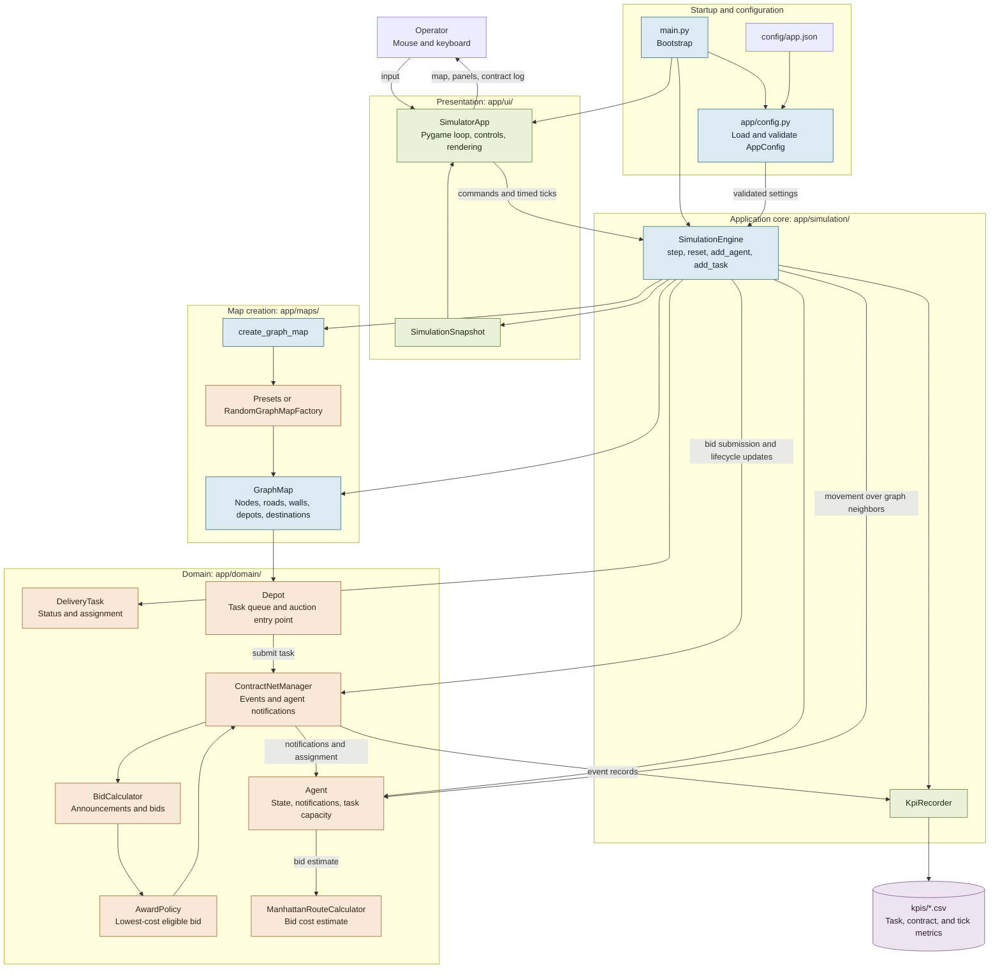

# Multi-Agent Delivery Simulator — Application Architecture

This component view follows the implementation under `output/source-code/`. For the system-level layer view, see [architecture-overview.md](architecture-overview.md).

## Runtime flow

1. `main.py` loads and validates `config/app.json`, then creates the engine and Pygame application.
2. `SimulationEngine.reset()` creates a preset or random graph, validates it, initializes the contract-net manager and KPI recorder, and creates configured agents.
3. The UI sends manual commands and timed ticks to the engine. Each tick submits pending bids, processes agent actions, creates periodic tasks, closes auctions at their deadlines, and records simulation metrics.
4. A depot announces a task through `ContractNetManager`. Agents calculate a cost estimate using `ManhattanRouteCalculator`; `BidCalculator` tracks bids and `AwardPolicy` selects the lowest-cost bid once the deadline is reached.
5. Assigned agents pick up and deliver tasks through engine-coordinated domain state changes. Movement follows graph neighbors and uses BFS distances to guide movement toward an assigned task.
6. The engine returns a `SimulationSnapshot` for rendering. `KpiRecorder` writes package creation, bidding/contract events, and per-tick metrics to CSV files in `kpis/`.

## Ownership boundaries

- `main.py` wires configuration, engine, and UI at startup.
- `app/config.py` parses JSON into typed settings and validates map/depot limits.
- `app/simulation/engine.py` owns live simulation state and coordinates ticks, movement, task lifecycle, contract-net calls, and snapshots.
- `app/domain/entities/` defines the simulation's state-bearing entities and messages. `app/domain/services/` implements auction, award, and bid-distance behavior.
- `app/maps/` constructs graph maps. `app/ui/` handles Pygame input and rendering. `app/simulation/kpi_recorder.py` persists CSV metrics.

## Current implementation note

Action selection still uses the engine's milestone random-action policy. The `ManhattanRouteCalculator` is used for bid cost estimates; movement itself is graph-based and uses BFS distances in the engine, not that calculator.
