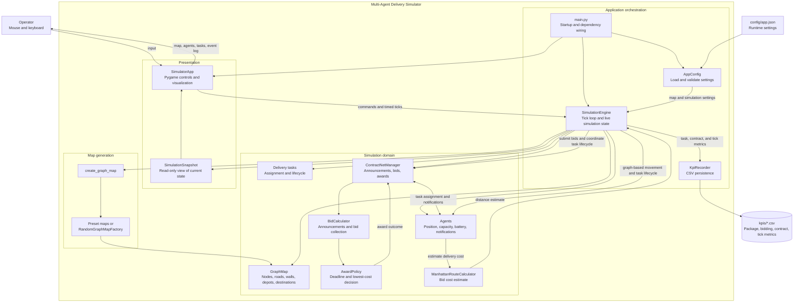

# Multi-Agent Delivery Simulator — Architecture Overview

This overview describes the running application at the system boundary and shows how its major layers collaborate. The detailed component flow is in [application-architecture.md](application-architecture.md).

## Architectural boundaries

- **Presentation:** `app/ui/` owns the Pygame event loop, controls, and rendering. It sends user commands to the engine and renders an engine snapshot.
- **Application core:** `main.py` loads configuration and wires the UI to `SimulationEngine`. The engine owns the tick loop and coordinates live state, tasks, auctions, and snapshots.
- **Map generation:** `app/maps/` creates preset or random maps and returns a `GraphMap` used by the engine for placement and movement.
- **Domain:** `app/domain/entities/` holds agents, tasks, depots, destinations, graph nodes, and contract-net messages. `ContractNetManager`, `BidCalculator`, and `AwardPolicy` coordinate announcements, bid collection, and deadline-based awards. Agents use `ManhattanRouteCalculator` for bid cost estimates.
- **Persistence:** `KpiRecorder` writes package creation, bidding, contract-net events, and per-tick metrics as CSV files under `kpis/`.

## Runtime at a glance

1. Startup loads and validates `config/app.json`, then the engine asks `app/maps/` to create a preset or random graph and initializes agents.
2. The UI sends manual commands or timed ticks to the engine.
3. Each tick submits pending bids, processes agent actions and task transitions, closes auctions that reached their deadline, and records metrics.
4. The UI redraws from a snapshot; KPI data is written to CSV.

## Current implementation note

The engine currently selects agent actions through its milestone random-action policy. Movement is constrained by graph neighbors and uses BFS distances to guide assigned deliveries. Bid cost estimation uses Manhattan distance; it is separate from movement routing.
