# Multi-Agent Delivery Simulator — Simulation Sequence

This diagram shows one `SimulationEngine.step()` call. The Step control invokes it directly and Auto mode schedules the same call. Tasks are assigned by deadline-based auctions, and agents only move while they have an assigned task.

```mermaid
sequenceDiagram
    autonumber
    actor Operator
    participant App as SimulatorApp
    participant Engine as SimulationEngine
    participant Graph as GraphMap
    participant Depot
    participant Contract as ContractNetManager
    participant BidCalc as BidCalculator
    participant Award as AwardPolicy
    participant Agent
    participant Route as ManhattanRouteCalculator
    participant Task as DeliveryTask
    participant KPI as KpiRecorder

    Operator->>App: Step or Auto tick is due
    App->>Engine: step()
    alt all agents are already out of order
        Engine->>Engine: stop_if_all_agents_stranded()
    else run tick
        Engine->>Engine: increment tick and shuffle agents
        loop each agent
            Engine->>Engine: _step_agent(agent)
            alt agent is out of order
                Engine->>Agent: keep out-of-order action
            else agent is active
                Engine->>Engine: submit pending bids
                opt agent has an eligible unsubmitted bid
                    Engine->>Contract: record_bid(agent_id, task_id, cost, tick)
                    Contract->>BidCalc: record_bid(...)
                    BidCalc->>BidCalc: store AUCTION_BID
                    Contract-->>Engine: AUCTION_BID
                    Engine->>KPI: record_contract_event(AUCTION_BID)
                end

                alt agent is loading or charging
                    Engine->>Agent: advance loading state
                    Agent->>Contract: set status BUSY or LOADING
                else battery is empty away from a depot
                    Engine->>Agent: mark_stranded(tick)
                    Agent->>Contract: AGENT_OUT_OF_ORDER
                else assigned pickup task is at this depot
                    Engine->>Engine: pick_up_task(agent)
                    Engine->>Agent: pick_task(task)
                    Agent->>Task: set IN_TRANSIT and increase load
                    Engine->>Contract: start_task_for_agent(...)
                    Contract->>Contract: append TASK_IN_TRANSIT
                    Engine->>Contract: AGENT_PICK_OFF at current cell
                else handle assigned task or idle agent
                    Engine->>Engine: choose_action(agent)
                    alt no assigned task
                        Engine->>Agent: action IDLE and no movement
                    else agent is at assigned destination
                        Engine->>Engine: deliver_task(agent)
                        Engine->>Agent: deliver_task(task)
                        Agent->>Task: set DELIVERED and clear assignment and load
                        Engine->>Contract: deliver_task_for_agent(...)
                        Contract->>Contract: append TASK_DELIVERED
                        Engine->>Contract: AGENT_DROP_OFF at destination
                    else assigned task is still en route
                        loop each movement cell up to agent speed
                            Engine->>Graph: get walkable neighbors
                            Graph-->>Engine: available adjacent cells
                            Engine->>Engine: avoid occupied cells and follow BFS distance to task target
                            Engine->>Agent: move_to(next cell)
                            alt task status is AWAIT_PICKUP
                                Engine->>Contract: AGENT_MOVING_PICK_UP with current cell
                            else task status is IN_TRANSIT
                                Engine->>Contract: AGENT_MOVING_DROPOFF with current cell
                            end
                            opt agent reaches assigned depot
                                Engine->>Engine: pick_up_task(agent)
                                Engine->>Agent: pick_task(task)
                                Agent->>Task: set IN_TRANSIT
                                Engine->>Contract: append TASK_IN_TRANSIT and AGENT_PICK_OFF
                            end
                        end
                    end
                end
            end
            Engine->>Engine: update_agent_status(agent)
            Engine->>Contract: emit one status event for this agent and tick
        end

        opt every fifth tick
            Engine->>Engine: add_task()
            Engine->>Depot: add_task(task)
            Engine->>KPI: record_task_created(...)
            Engine->>Depot: submit_task(task, tick, deadline)
            Depot->>Contract: submit_task(...)
            Contract->>BidCalc: announce_task(...)
            BidCalc->>BidCalc: store AUCTION_ANNOUNCE and initialize bids
            Contract->>Task: set OPEN
            Contract->>Contract: append TASK_OPEN
            loop each registered agent
                Contract->>Agent: receive_notification(AUCTION_ANNOUNCE)
                alt task capacity and resources allow a bid
                    Agent->>Route: estimate bid cost using Manhattan distance
                    Route-->>Agent: estimated cost
                    Agent->>Agent: store delivery entry
                else resources are insufficient
                    Agent-->>Contract: AGENT_NO_BID
                end
            end
            Engine->>KPI: record package and resource-refusal events
        end

        Engine->>Contract: award_ready_tasks(tasks, tick)
        Contract->>BidCalc: award_ready_tasks(...)
        loop each open task whose deadline has arrived
            BidCalc->>Award: decide(announcement, bids, tick)
            Award-->>BidCalc: lowest-cost bid or no winner
            BidCalc->>BidCalc: create AUCTION_AWARD and AUCTION_BID_LOST, or AUCTION_NO_BID
        end
        BidCalc-->>Contract: auction outcomes
        loop each auction outcome
            Contract->>Contract: append outcome
            alt AUCTION_AWARD
                Contract->>Task: assign winner and set AWAIT_PICKUP
                Contract->>Agent: notify winner and set BUSY
                Contract->>Contract: append TASK_ASSIGNED and TASK_AWAIT_PICKUP
            else AUCTION_BID_LOST
                Contract->>Agent: notify losing agent
                Agent->>Agent: remove saved delivery entry
            else AUCTION_NO_BID
                Contract-->>Engine: AUCTION_NO_BID
                Engine->>Contract: close_task(...)
                Contract->>Task: clear assignment and set NO_BID
            end
        end
        Engine->>KPI: record simulation tick and auction outcomes
        Engine->>Engine: stop_if_all_agents_stranded and flush contract log
    end
    Engine-->>App: step complete
    App->>Engine: snapshot()
    Engine-->>App: graph, agents, tasks, per-agent pickup counts, events
    App-->>Operator: render map, depot badges, agent status, and contract log
```

## Task state and agent messages

| Moment | Task state | Depot badge | Agent activity message |
| --- | --- | --- | --- |
| Auction is open | `OPEN` | `OPEN` | Bid response or `AGENT_NO_BID` |
| Agent wins and travels to depot | `AWAIT_PICKUP` | `AWAIT_PICK_OFF` | `AGENT_MOVING_PICK_UP` with the cell reached |
| Pickup succeeds | `IN_TRANSIT` | `IN_TRANSIT` | `AGENT_PICK_OFF` |
| Agent travels to destination | `IN_TRANSIT` | `IN_TRANSIT` | `AGENT_MOVING_DROPOFF` with the cell reached |
| Delivery succeeds | `DELIVERED` | `DELIVERED` | `AGENT_DROP_OFF` |

Each processed agent emits one status message per simulation tick (`AGENT_IDLE`, `AGENT_BUSY`, `AGENT_LOADING`, or `AGENT_OUT_OF_ORDER`). Movement messages are additional activity events and include the agent's resulting cell coordinate.
