# Multi-Agent Delivery Simulator — Simulation Sequence

This sequence reflects the current `SimulationEngine.step()` implementation. The engine schedules ticks and coordinates movement in the shared graph. Agents choose actions and own pickup, delivery, and charging state transitions. Contract-net events are collected by `ContractNetManager` and exposed through the simulation snapshot.

```mermaid
sequenceDiagram
    autonumber
    actor Operator
    participant App as SimulatorApp
    participant Engine as SimulationEngine
    participant Graph as GraphMap
    participant Depot
    participant Agent
    participant Task as DeliveryTask
    participant Contract as ContractNetManager
    participant BidCalc as BidCalculator
    participant Award as AwardPolicy
    participant KPI as KpiRecorder

    Operator->>App: Step or Auto tick is due
    App->>Engine: step()
    alt all agents are stranded
        Engine->>Engine: stop_if_all_agents_stranded()
    else run tick
        Engine->>Engine: increment tick and shuffle agents
        loop each agent
            Engine->>Engine: _step_agent(agent)
            alt agent is stranded
                Engine->>Agent: keep STRANDED action
            else agent is active
                opt agent has eligible unsubmitted bids
                    Engine->>Agent: submit_pending_bids(tick)
                    Agent->>Agent: find announced, open, not-yet-bid deliveries
                    Agent->>Contract: record_bid(agent_id, task_id, cost, tick)
                    Contract->>BidCalc: record_bid(...)
                    BidCalc->>BidCalc: store AUCTION_BID
                    Contract->>Contract: append AUCTION_BID
                end
                Engine->>Engine: update_agent_status(agent)
                alt agent is LOADING
                    Engine->>Agent: advance_loading(tick)
                    Agent->>Agent: advance loading/charge timer and battery state
                    opt action is CHARGE
                        Agent->>Contract: record AGENT_CHARGE
                    end
                else agent is at a depot
                    Engine->>Agent: pick_up_task(tick)
                    alt assigned task is available here
                        Agent->>Task: set IN_TRANSIT and increase load
                        Agent->>Contract: start_task_for_agent(...)
                        Contract->>Contract: append TASK_IN_TRANSIT
                        Agent->>Contract: record AGENT_PICK_OFF
                        Agent-->>Engine: picked task
                        Engine->>Engine: log pickup message
                    else no task is picked up
                        Engine->>Agent: start_charging(duration, tick)
                        alt battery needs charging
                            Agent->>Contract: record AGENT_CHARGE
                        else battery is full
                            Engine->>Engine: delegate choose_action(agent)
                            Engine->>Agent: choose_action()
                            Agent-->>Engine: MOVE, PICKUP, DELIVER, or IDLE
                        end
                    end
                else choose an action
                    Engine->>Engine: delegate choose_action(agent)
                    Engine->>Agent: choose_action()
                    Agent-->>Engine: MOVE, PICKUP, DELIVER, or IDLE
                end

                opt an action was selected
                    Engine->>Agent: set current_action
                    alt action is MOVE
                        Engine->>Engine: move_agent(agent)
                        loop each movement cell up to agent speed
                            Engine->>Graph: get walkable neighbors
                            Graph-->>Engine: adjacent cells
                            Engine->>Engine: exclude occupied/reserved cells and follow shortest route
                            alt no route cell is available
                                Engine->>Agent: set WAIT status/action
                                Agent->>Contract: record AGENT_WAIT
                            else a route cell is available
                                Engine->>Agent: move_to(next cell)
                                Agent->>Agent: update position and battery
                                Engine->>Contract: record movement event with resulting cell
                                opt agent reaches a depot
                                    Engine->>Agent: pick_up_task(tick)
                                    alt task is picked up
                                        Agent->>Task: set IN_TRANSIT and increase load
                                        Agent->>Contract: record TASK_IN_TRANSIT and AGENT_PICK_OFF
                                        Engine->>Engine: log pickup message
                                    else no task is picked up
                                        Engine->>Agent: start_charging(duration, tick)
                                    end
                                end
                            end
                        end
                    else action is PICKUP
                        Engine->>Agent: pick_up_task(tick)
                        Agent->>Contract: record pickup lifecycle events
                        Engine->>Engine: log pickup message
                    else action is DELIVER
                        Engine->>Engine: verify target node
                        Engine->>Agent: deliver_assigned_task(tick)
                        Agent->>Task: set DELIVERED and clear assignment/load
                        Agent->>Contract: deliver_task_for_agent(...)
                        Contract->>Contract: append TASK_DELIVERED
                        Agent->>Contract: record AGENT_DROP_OFF
                        Engine->>Engine: log delivery message
                    else action is IDLE
                        Engine->>Engine: leave agent in place
                    end
                end
            end
            Engine->>Engine: update status unless agent is waiting
            Engine->>Contract: record agent status for this tick
        end

        opt every fifth tick
            Engine->>Engine: add_task()
            Engine->>Depot: add_task(task)
            Engine->>KPI: record_task_created(...)
            Engine->>Depot: submit_task(task, tick, deadline)
            Depot->>Contract: submit_task(...)
            Contract->>BidCalc: announce_task(...)
            BidCalc->>BidCalc: initialize auction and bid list
            Contract->>Task: set OPEN
            Contract->>Contract: append AUCTION_ANNOUNCE and TASK_OPEN
            loop each registered agent
                Contract->>Agent: receive_notification(AUCTION_ANNOUNCE)
                alt task capacity is available
                    Agent->>Agent: estimate cost
                    alt estimated cost is finite
                        Agent->>Agent: save delivery for bidding
                    else estimated cost exceeds battery range
                        Agent-->>Contract: AGENT_NO_BID
                        Contract->>Contract: append AGENT_NO_BID
                    end
                else no task capacity
                    Agent->>Agent: keep no delivery and send no response
                end
            end
            Engine->>Engine: flush new manager events
            Engine->>KPI: persist contract events and contract log rows
        end

        Engine->>Contract: award_ready_tasks(tasks, tick)
        Contract->>BidCalc: award_ready_tasks(...)
        loop each open auction past its deadline
            BidCalc->>Award: decide(announcement, bids, tick)
            Award-->>BidCalc: winning bid or no winner
            BidCalc->>BidCalc: create award, lost-bid, or no-bid events
        end
        BidCalc-->>Contract: auction outcomes
        loop each outcome
            Contract->>Contract: append outcome and notify the affected agent
            alt outcome is AUCTION_AWARD
                Contract->>Task: set AWAIT_PICKUP and assign agent
                Contract->>Agent: set MOVING_TO_PICKUP
                Contract->>Contract: append TASK_ASSIGNED and TASK_AWAIT_PICKUP
            else outcome is AUCTION_BID_LOST
                Contract->>Agent: notify losing agent
                Agent->>Agent: remove saved delivery
            else outcome is AUCTION_NO_BID
                Contract-->>Engine: AUCTION_NO_BID
                Engine->>Contract: close_task(...)
                Contract->>Task: set NO_BID and clear assignment
            end
        end
        Engine->>KPI: record_simulation_tick(...)
        Engine->>Engine: stop_if_all_agents_stranded() and flush manager events
        Engine->>KPI: persist new contract events and contract log rows
    end
    Engine-->>App: step complete
    App->>Engine: snapshot()
    Engine-->>App: graph, agents, tasks, pickup counts, manager events
    App-->>Operator: render map, depot table, agent status, and contract log
```

## Task and Agent States

| Situation | Task state | Depot badge | Contract-net event |
| --- | --- | --- | --- |
| Auction is open | `OPEN` | `OPEN` | `AUCTION_ANNOUNCE`, `TASK_OPEN` |
| Agent is assigned and traveling to depot | `AWAIT_PICKUP` | `AWAIT_PICK_OFF` | `AGENT_MOVING_TO_PICKUP` |
| Agent cannot make a route step | unchanged | unchanged | `AGENT_WAIT` |
| Agent picks up a task | `IN_TRANSIT` | `IN_TRANSIT` | `AGENT_PICK_OFF`, `TASK_IN_TRANSIT` |
| Agent travels to destination | `IN_TRANSIT` | `IN_TRANSIT` | `AGENT_MOVING_TO_DROPOFF` |
| Agent moves one cell | unchanged | unchanged | movement event with resulting cell |
| Agent is charging | unchanged | unchanged | `AGENT_CHARGE` |
| Agent delivers a task | `DELIVERED` | `DELIVERED` | `AGENT_DROP_OFF`, `TASK_DELIVERED` |
| Agent has no assigned task | unchanged | unchanged | `AGENT_IDLE` |

Every processed agent emits a status event each tick: `AGENT_IDLE`, `AGENT_MOVING_TO_PICKUP`, `AGENT_MOVING_TO_DROPOFF`, `AGENT_WAIT`, `AGENT_LOADING`, or `AGENT_OUT_OF_ORDER`.
