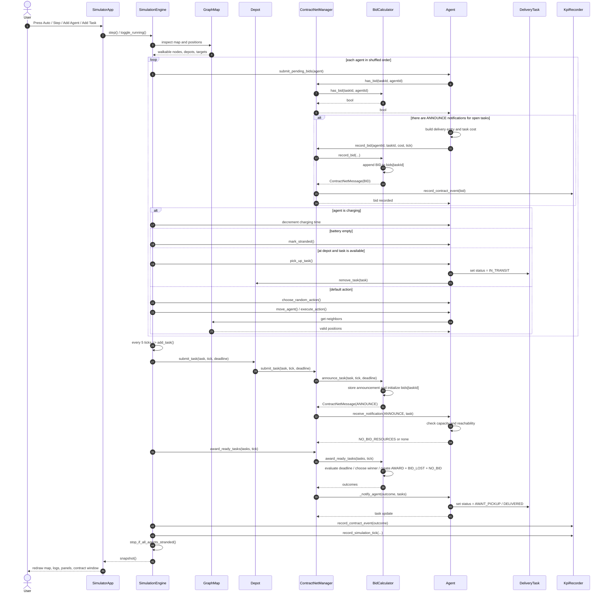

# Multi-Agent Delivery Simulator — Sequence Diagram for One Tick

## Why the earlier version was wrong

The bug in the earlier diagram was that it showed bids being sent directly to the contract manager without the actual stateful auction logic in the BidCalculator.

In the real implementation:

1. `ContractNetManager.submit_task()` announces the task.
2. Each agent evaluates the task and may create a delivery entry.
3. `SimulationEngine.submit_pending_bids()` calls `ContractNetManager.record_bid()`.
4. `ContractNetManager.record_bid()` delegates to `BidCalculator.record_bid()`.
5. `BidCalculator` stores bids in `self.bids[task_id]` and exposes `has_bid()` and `award_ready_tasks()`.
6. Only later, when the deadline is reached, `award_ready_tasks()` selects the winner and emits `AWARD` / `BID_LOST` / `NO_BID` messages.

So the correct flow is: task announcement -> bid storage in the BidCalculator -> deadline-based award decision -> agent notifications.
